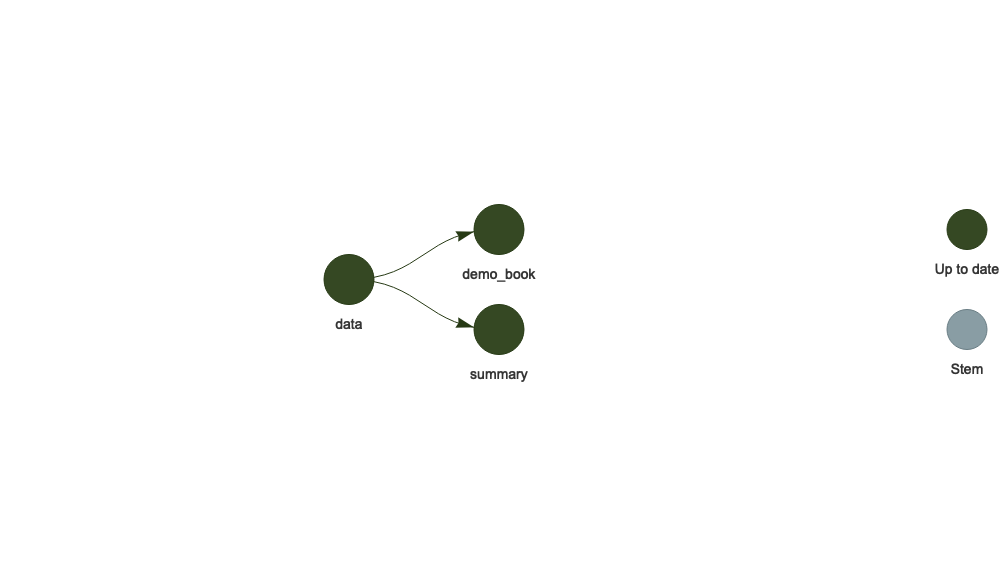
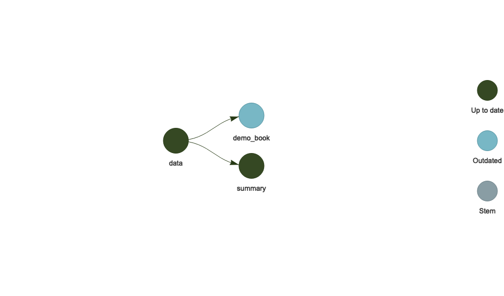

<!-- README.md is generated from README.Rmd. Please edit that file -->

# tar-render-book-demo

The goal of tar-render-book-demo is to provide a preview of creating a
bookdown book using a [targets](https://github.com/ropensci/targets)
pipeline.

This project was created with the template book by calling
`bookdown::create_bs4_book(path = "demo-book")`. I added a section to
the file `demo-book/01-intro.Rmd` to use the `data` target created as
part of the default `_targets.R` file generated with
`targets::tar_script()`. I also modified the `demo-book/index.Rmd` file
to write the ‘packages.bib’ to `demo-book/packages.bib`.

After running the pipeline, any time we update or modify a file in the
“demo-book” folder, the target `demo_book` will become outdated.

## `_targets.R` File

    library(targets)

    source("R/utils-tar-render-book.R")
    source("R/tar-render-book.R")

    summ <- function(dataset) {
      dplyr::summarize(dataset, mean_x = mean(x))
    }

    # Set target-specific options such as packages.
    tar_option_set(packages = "dplyr")

    # End this file with a list of target objects.
    list(
      tar_target(data, data.frame(x = sample.int(100), y = sample.int(100))),
      tar_target(summary, summ(data)),
      tar_render_book(
        demo_book,
        path = "demo-book",
        # Will create bs4_book and pdf_book
        output_format = c(
          "bookdown::bs4_book",
          "bookdown::pdf_book"
        )
      )
    )

## Run and Visualize Pipeline

``` r
targets::tar_make()
✓ skip target data
• start target demo_book
Rendering book in directory 'demo-book'
Tweaking _book/index.html
Tweaking _book/hello-bookdown.html
Tweaking _book/adding-a-targets-dependency.html
Tweaking _book/cross.html
Tweaking _book/parts.html
Tweaking _book/footnotes-and-citations.html
Tweaking _book/blocks.html
Tweaking _book/sharing-your-book.html
Tweaking _book/references.html
Tweaking _book/404.html
• built target demo_book
✓ skip target summary
• end pipeline
targets::tar_visnetwork(targets_only = TRUE)
```

<!-- -->

## Invalidate Pipeline

We can invalidate the pipeline by modifying any of the files in the
“demo-book” directory. One easy way is just to add a new line to a file.

``` r
writeLines(
  text = c(
    readLines("demo-book/01-intro.Rmd"), 
    "new line here!"
    ),
  con = "demo-book/01-intro.Rmd"
  )
```

``` r
targets::tar_visnetwork(targets_only = TRUE)
```

<!-- -->
